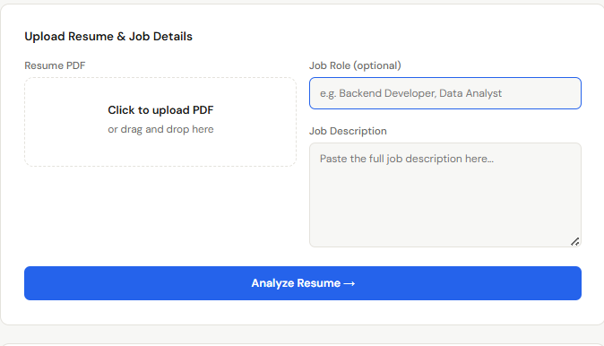
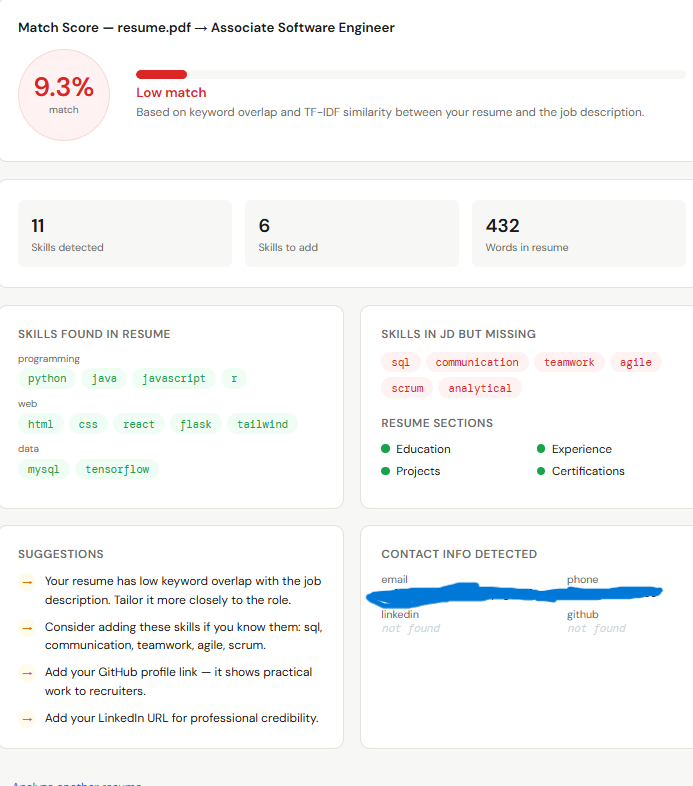

# Virtusa-Mini-Project-Python-ResumeAnalyzerAndJobMatcher
Web-based resume analyzer built with flask that match resumes with job descriptions using TF-IDF and cosine similarity. Extracts skills missing keywords and provide suggestions to be more relevant. History tracked with sqlite.

# What it does
>Upload a resume
>Give job description
>Get:
  >A match score(0-100)
  >Skills detected in the resume and missing skills
  >Suggestions to improve resume

# Tech Stack Used
> Python
> Flask
> SQLite(Stores Previous analysis details)
> NLTK(Text Processing)
> Scikit-learn
> HTML+CSS

# My Approach (How it Works)
>The uploaded PDF is read using pdfplumber.
>The text is converted to lowercase for consistent matching.
>I created a predefined skill list and used regex to find those skills in the resume.
>Both the resume and job description are converted into vectors using TF-IDF.
>Cosine similarity is calculated between them to generate a match score.
>Skills present in the job description but missing in the resume are identified.
>Based on all this, the application generates simple suggestions.


# Project Structure
```
resume_analyzer/

app.py → handles routes and file upload
resume_analyzer.py → main logic (NLP + scoring)
templates/ → HTML pages
data/history.db → SQLite database
uploads/ → temporary files
```
# Instructions to run
> Create a virtual Environment
> Activate it
> Istall all dependencies from requirements.txt
> Run the app

# Output screenshots




