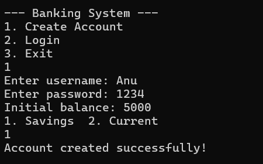
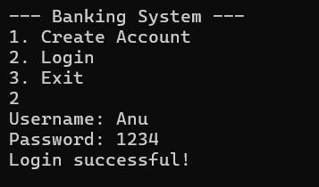
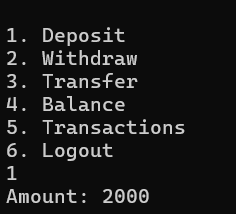
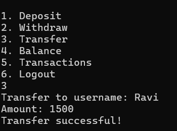
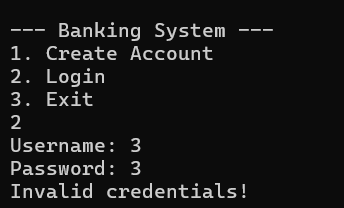
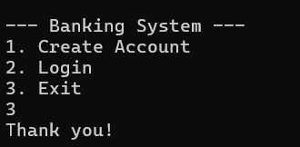

# Java Banking System Simulation

## Overview

This project is a console-based banking system developed using Core Java. It simulates real-world banking operations such as account creation, authentication, transactions, and transaction history management. The project demonstrates the use of object-oriented programming principles in a practical application.

## Objectives

* Simulate core banking functionalities
* Manage user accounts securely
* Implement transaction handling
* Apply object-oriented programming concepts

## Features

### Account Management

* Create Savings or Current accounts
* Assign unique account IDs to users

### Authentication

* Login using username and password
* Basic credential validation

### Transactions

* Deposit money
* Withdraw money
* Transfer funds between accounts

### Account Services

* Balance inquiry
* View transaction history

## Technologies Used

* Java (Core Java)
* Object-Oriented Programming

  * Encapsulation
  * Inheritance
  * Polymorphism
* Java Collections Framework

  * ArrayList for transaction history
  * HashMap for user management

## Project Structure
```
java/
 ├── model/
 │    ├── Account.java
 │    ├── SavingsAccount.java
 │    ├── CurrentAccount.java
 │    ├── Transaction.java
 │
 ├── service/
 │    ├── BankService.java
 │    ├── AuthService.java
 │
 └── Main.java

```
## How to Run

Step 1: Navigate to the project folder

cd java


Step 2: Compile the program


javac Main.java model/*.java service/*.java


Step 3: Run the program


java Main


## Sample Operations

* Create account
* Login
* Deposit money
* Withdraw money
* Transfer funds
* Check balance
* View transaction history

## Sample Outputs:






## Key Concepts Demonstrated

* Modular design using packages
* Encapsulation for secure data handling
* Inheritance for account types
* Use of collections for storing data
* Console-based user interaction

## Future Enhancements

* Integration with a database such as MySQL
* Password encryption
* Graphical user interface
* REST API implementation using Spring Boot

## License

This project is intended for educational purposes.
